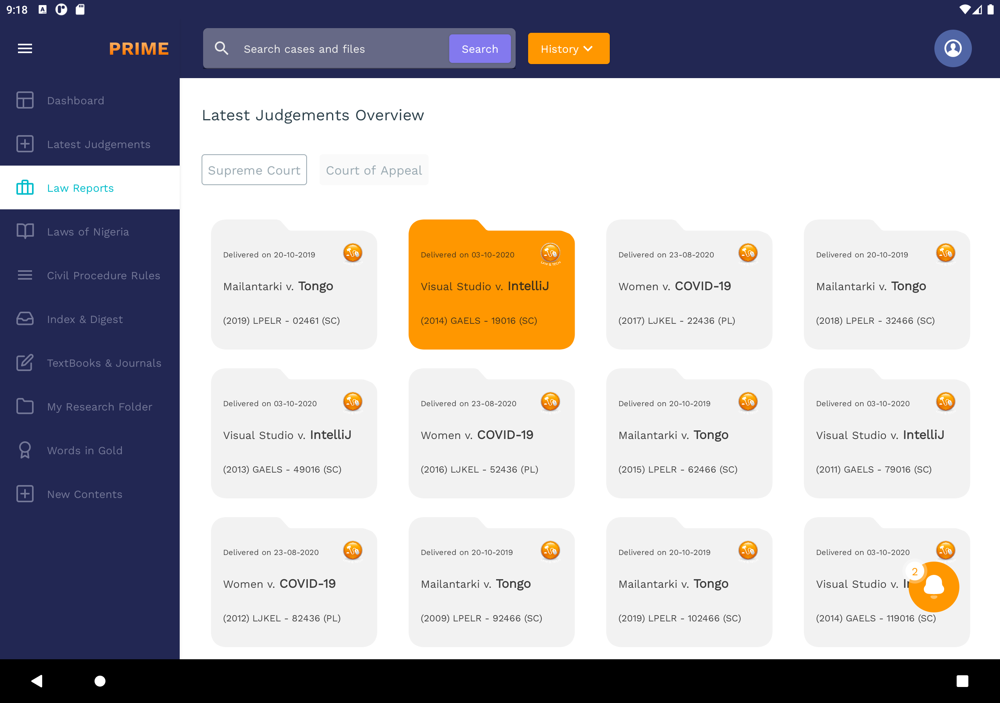
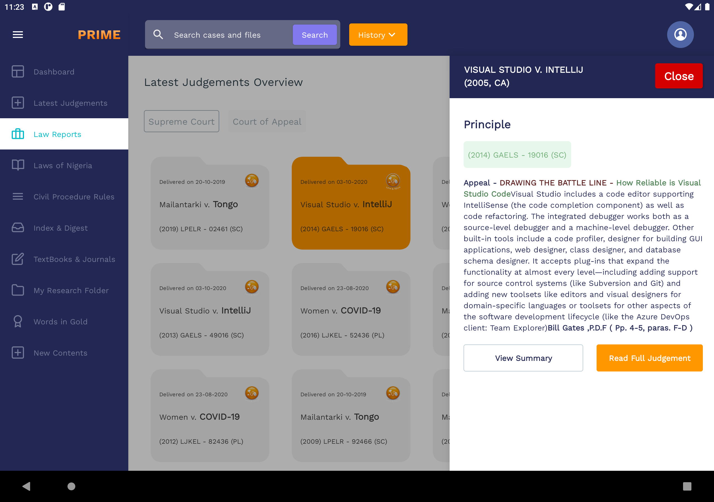
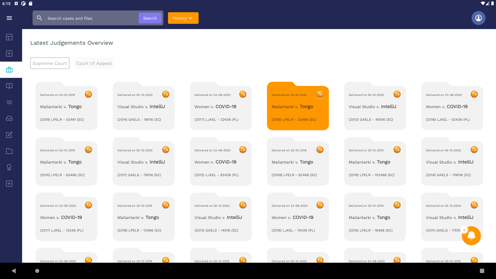
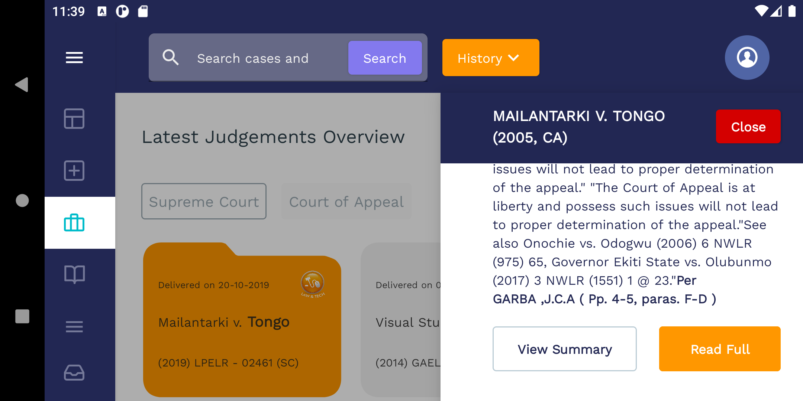
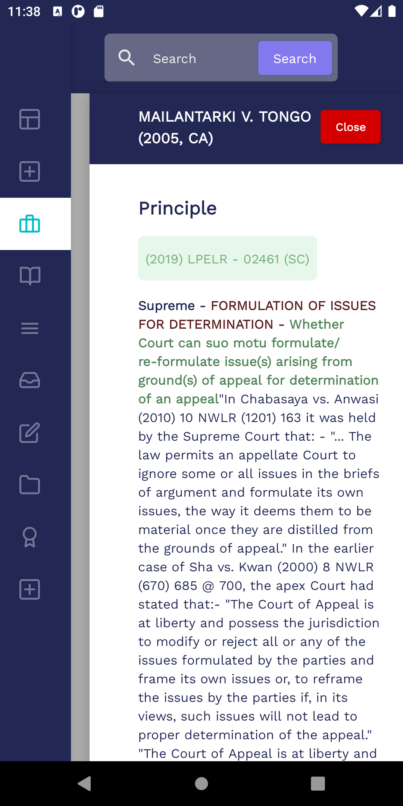
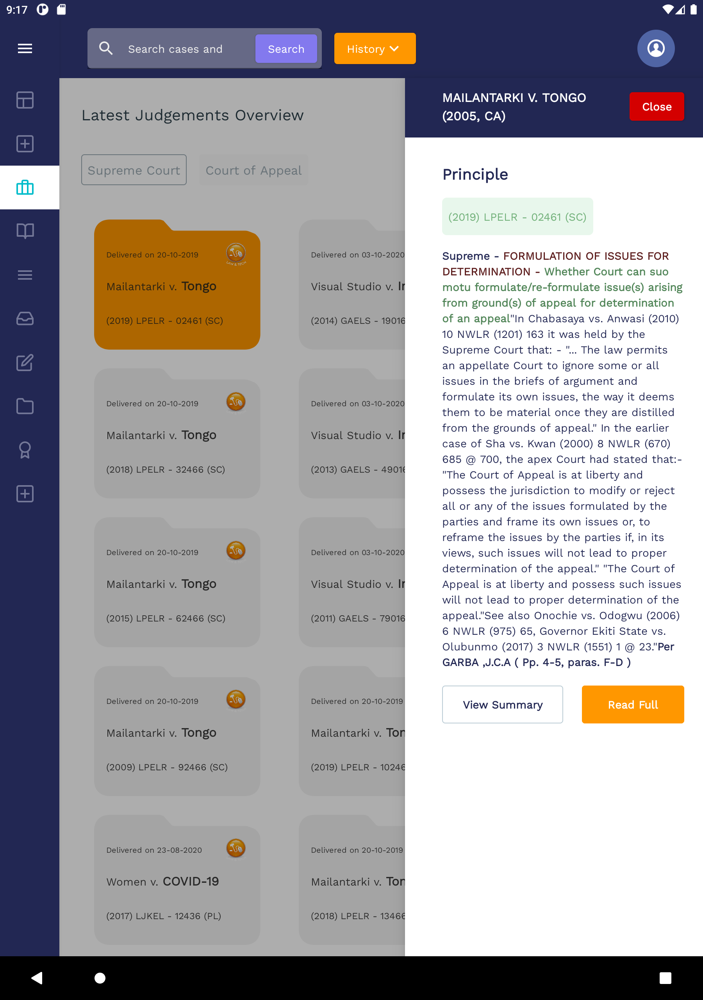
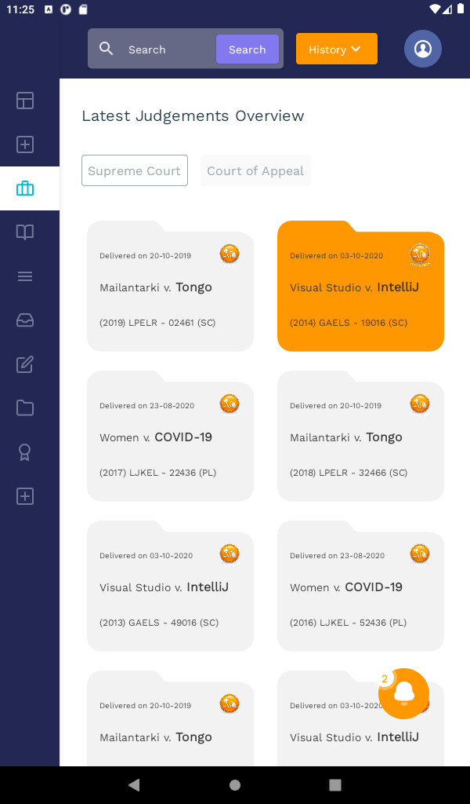
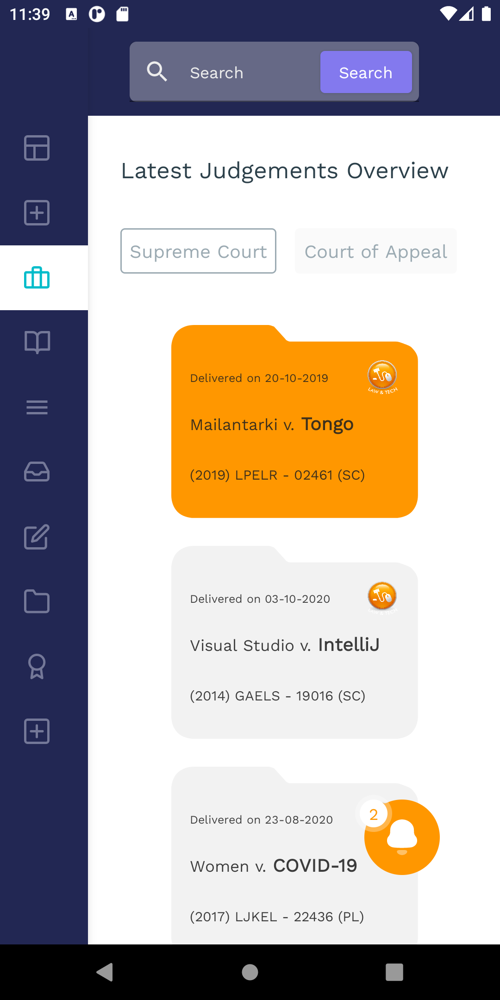

# law-pavilion

The first time you launch the app, you won't see any folder. But at this momemt, room has created a database and populated it with the content of data.json found in the assets folder. When you relaunch the app, you should be able to see some folders now as well as their details in the drawer when you click on any one.

|            |            |            |            |
|------------|------------|------------|------------|
|  |  |  |  |
|            |            |            |            |
|------------|------------|------------|------------|
|  |  |  |  |

# technologies used
Hilt - for dependency injection

Room - for database management

Jetpack compose - for declarative-style UI

Kotlin Coroutines - for asynchronous programming

Kotlin Flows (StateFlow and MutableStateFlow) - for reactive programming 

Moshi - for parsing Json objects

# architectural pattern
I used MVVM architecture with repository pattern while adopting principles of clean architecture for seperation of concerns. By this appoach, I made sure each class has a singular responsibilit and also that abstractions do not depened on details while carefully segregrating interfaces. 

# side note
I used a custom solution to make the modal drawer appear on the right side as opposed to the default left side. I couldn't find an out-of-the-box first party or even third party solution that would have allowed me do this seamlessly with jetpack compose. Because of this, I had to account for different screen sizes manually and therefore areas exist that still needs improvement in order to achieve perfect rendering on any screen size. My approcah was to make the ui not only specific for tablets device but adaptable to any screen size and form, including mobile phones. Hence, you can see why I have provided screenshots for both mobile and tablet in portrait and landscape mode to show how well the ui adapts beautifully.
