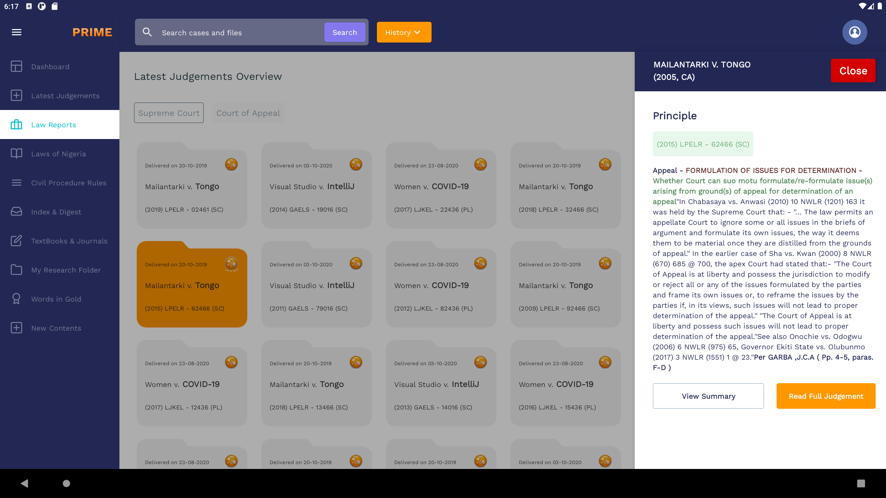

# law-pavilion

|            |            |            |            |
|------------|------------|------------|------------|
|  |  |  |  |

# technologies used
Hilt - for dependency injection

Room - for database management

Jetpack compose - for declarative-style UI

Kotlin Coroutines - for asynchronous programming

Kotlin Flows (StateFlow and MutableStateFlow) - for reactive programming 

Moshi - for parsing Json objects

# architectural pattern
I used MVVM architecture with repository pattern while adopting principles of clean architecture for seperation of concerns. By this appoach, I made sure each class has a singular responsibilit and also that abstractions do not depened on details while carefully segregrating interfaces. 

